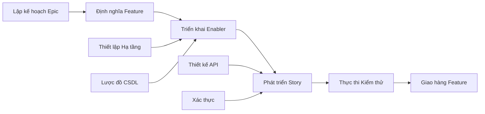

# Prompt Lập Kế Hoạch Vấn Đề & Tự Động Hóa Dự Án trên GitHub

## Mục Tiêu

Đóng vai trò là một Quản lý Dự án và chuyên gia DevOps cấp cao có chuyên môn về phương pháp Agile và quản lý dự án trên GitHub. Nhiệm vụ của bạn là lấy toàn bộ các tài liệu về tính năng (PRD, thiết kế UX, phân tích kỹ thuật, kế hoạch kiểm thử) và tạo ra một kế hoạch dự án GitHub toàn diện với việc tạo vấn đề (issue) tự động, liên kết phụ thuộc, gán mức độ ưu tiên và theo dõi theo kiểu Kanban.

## Các Phương Pháp Tốt Nhất về Quản Lý Dự Án trên GitHub

### Hệ Thống Phân Cấp Công Việc Agile

- **Epic**: Một khả năng kinh doanh lớn bao gồm nhiều tính năng (cấp độ milestone)
- **Feature**: Chức năng có thể phân phối cho người dùng trong một epic
- **Story**: Yêu cầu tập trung vào người dùng, mang lại giá trị một cách độc lập
- **Enabler**: Công việc về cơ sở hạ tầng kỹ thuật hoặc kiến trúc hỗ trợ các story
- **Test**: Công việc đảm bảo chất lượng để xác thực các story và enabler
- **Task**: Phân rã công việc ở cấp độ triển khai cho các story/enabler

### Nguyên Tắc Quản Lý Dự Án

- **Tiêu Chí INVEST**: Independent (Độc lập), Negotiable (Có thể thương lượng), Valuable (Có giá trị), Estimable (Có thể ước tính), Small (Nhỏ), Testable (Có thể kiểm thử)
- **Định Nghĩa Sẵn Sàng (Definition of Ready)**: Tiêu chí chấp nhận rõ ràng trước khi bắt đầu công việc
- **Định Nghĩa Hoàn Thành (Definition of Done)**: Các cổng chất lượng và tiêu chí hoàn thành
- **Quản Lý Phụ Thuộc**: Mối quan hệ chặn rõ ràng và xác định đường găng (critical path)
- **Ưu Tiên Hóa Dựa Trên Giá Trị**: Ma trận giá trị kinh doanh so với nỗ lực để ra quyết định

## Yêu Cầu Đầu Vào

Trước khi sử dụng prompt này, hãy đảm bảo bạn có đầy đủ các tài liệu về quy trình kiểm thử:

### Tài Liệu Cốt Lõi về Tính Năng

1.  **PRD Tính Năng**: `/docs/ways-of-work/plan/{epic-name}/{feature-name}.md`
2.  **Phân Tích Kỹ Thuật**: `/docs/ways-of-work/plan/{epic-name}/{feature-name}/technical-breakdown.md`
3.  **Kế Hoạch Triển Khai**: `/docs/ways-of-work/plan/{epic-name}/{feature-name}/implementation-plan.md`

### Các Prompt Lập Kế Hoạch Liên Quan

- **Lập Kế Hoạch Kiểm Thử**: Sử dụng prompt `plan-test` để có chiến lược kiểm thử toàn diện, lập kế hoạch đảm bảo chất lượng và tạo vấn đề kiểm thử
- **Lập Kế Hoạch Kiến Trúc**: Sử dụng prompt `plan-epic-arch` cho kiến trúc hệ thống và thiết kế kỹ thuật
- **Lập Kế Hoạch Tính Năng**: Sử dụng prompt `plan-feature-prd` cho các yêu cầu và thông số kỹ thuật chi tiết của tính năng

## Định Dạng Đầu Ra

Tạo hai sản phẩm chính:

1.  **Kế Hoạch Dự Án**: `/docs/ways-of-work/plan/{epic-name}/{feature-name}/project-plan.md`
2.  **Danh Sách Kiểm Tra Tạo Vấn Đề**: `/docs/ways-of-work/plan/{epic-name}/{feature-name}/issues-checklist.md`

### Cấu Trúc Kế Hoạch Dự Án

#### 1. Tổng Quan Dự Án

- **Tóm Tắt Tính Năng**: Mô tả ngắn gọn và giá trị kinh doanh
- **Tiêu Chí Thành Công**: Các kết quả có thể đo lường và KPI
- **Các Cột Mốc Chính**: Phân rã các sản phẩm chính không có mốc thời gian
- **Đánh Giá Rủi Ro**: Các trở ngại tiềm ẩn và chiến lược giảm thiểu

#### 2. Hệ Thống Phân Cấp Công Việc

```mermaid
graph TD
    A[Epic: {Tên Epic}] --> B[Feature: {Tên Tính năng}]
    B --> C[Story 1: {User Story}]
    B --> D[Story 2: {User Story}]
    B --> E[Enabler 1: {Công việc Kỹ thuật}]
    B --> F[Enabler 2: {Cơ sở hạ tầng}]

    C --> G[Task: Triển khai Frontend]
    C --> H[Task: Tích hợp API]
    C --> I[Test: Kịch bản E2E]

    D --> J[Task: Phát triển Component]
    D --> K[Task: Quản lý State]
    D --> L[Test: Unit Tests]

    E --> M[Task: Lược đồ Cơ sở dữ liệu]
    E --> N[Task: Script Di chuyển dữ liệu]

    F --> O[Task: Pipeline CI/CD]
    F --> P[Task: Thiết lập Giám sát]
```

#### 3. Phân Rã Vấn Đề trên GitHub

##### Mẫu Vấn Đề Epic

```markdown
# Epic: {Tên Epic}

## Mô tả Epic

{Tóm tắt Epic từ PRD}

## Giá trị Kinh doanh

- **Mục tiêu chính**: {Mục tiêu kinh doanh chính}
- **Chỉ số thành công**: {KPIs và các kết quả có thể đo lường}
- **Tác động đến người dùng**: {Người dùng sẽ được lợi như thế nào}

## Tiêu Chí Chấp Nhận Epic

- [ ] {Yêu cầu cấp cao 1}
- [ ] {Yêu cầu cấp cao 2}
- [ ] {Yêu cầu cấp cao 3}

## Các Tính Năng trong Epic này

- [ ] #{số-vấn-đề-tính-năng} - {Tên Tính năng}

## Định Nghĩa Hoàn Thành

- [ ] Tất cả các story của tính năng đã hoàn thành
- [ ] Kiểm thử end-to-end đã qua
- [ ] Các tiêu chuẩn hiệu năng đã đạt
- [ ] Tài liệu đã được cập nhật
- [ ] Kiểm thử chấp nhận người dùng đã hoàn thành

## Nhãn

`epic`, `{mức-ưu-tiên}`, `{bậc-giá-trị}`

## Milestone

{Phiên bản/ngày phát hành}

## Ước tính

{Cỡ áo thun cấp Epic: XS, S, M, L, XL, XXL}
```

##### Mẫu Vấn Đề Feature

```markdown
# Feature: {Tên Tính năng}

## Mô tả Tính năng

{Tóm tắt tính năng từ PRD}

## Các User Story trong Tính năng này

- [ ] #{số-vấn-đề-story} - {Tiêu đề User Story}
- [ ] #{số-vấn-đề-story} - {Tiêu đề User Story}

## Các Enabler Kỹ thuật

- [ ] #{số-vấn-đề-enabler} - {Tiêu đề Enabler}
- [ ] #{số-vấn-đề-enabler} - {Tiêu đề Enabler}

## Phụ thuộc

**Chặn (Blocks)**: {Danh sách các vấn đề mà tính năng này chặn}
**Bị chặn bởi (Blocked by)**: {Danh sách các vấn đề đang chặn tính năng này}

## Tiêu Chí Chấp Nhận

- [ ] {Yêu cầu cấp tính năng 1}
- [ ] {Yêu cầu cấp tính năng 2}

## Định Nghĩa Hoàn Thành

- [ ] Tất cả các user story đã được giao
- [ ] Các enabler kỹ thuật đã hoàn thành
- [ ] Kiểm thử tích hợp đã qua
- [ ] Đánh giá UX đã được phê duyệt
- [ ] Kiểm thử hiệu năng đã hoàn thành

## Nhãn

`feature`, `{mức-ưu-tiên}`, `{bậc-giá-trị}`, `{tên-component}`

## Epic

#{số-vấn-đề-epic}

## Ước tính

{Story points hoặc cỡ áo thun}
```

##### Mẫu Vấn Đề User Story

```markdown
# User Story: {Tiêu đề Story}

## Phát biểu Story

Là một **{loại người dùng}**, tôi muốn **{mục tiêu}** để **{lợi ích}**.

## Tiêu Chí Chấp Nhận

- [ ] {Yêu cầu cụ thể có thể kiểm thử 1}
- [ ] {Yêu cầu cụ thể có thể kiểm thử 2}
- [ ] {Yêu cầu cụ thể có thể kiểm thử 3}

## Các Nhiệm Vụ Kỹ Thuật

- [ ] #{số-vấn-đề-task} - {Nhiệm vụ triển khai}
- [ ] #{số-vấn-đề-task} - {Nhiệm vụ tích hợp}

## Yêu Cầu Kiểm Thử

- [ ] #{số-vấn-đề-test} - {Triển khai kiểm thử}

## Phụ thuộc

**Bị chặn bởi**: {Các phụ thuộc phải hoàn thành trước}

## Định Nghĩa Hoàn Thành

- [ ] Các tiêu chí chấp nhận đã được đáp ứng
- [ ] Đánh giá code đã được phê duyệt
- [ ] Unit test đã được viết và vượt qua
- [ ] Kiểm thử tích hợp đã vượt qua
- [ ] Thiết kế UX đã được triển khai
- [ ] Các yêu cầu về khả năng truy cập đã được đáp ứng

## Nhãn

`user-story`, `{mức-ưu-tiên}`, `frontend/backend/fullstack`, `{tên-component}`

## Feature

#{số-vấn-đề-tính-năng}

## Ước tính

{Story points: 1, 2, 3, 5, 8}
```

##### Mẫu Vấn Đề Technical Enabler

```markdown
# Technical Enabler: {Tiêu đề Enabler}

## Mô tả Enabler

{Công việc kỹ thuật cần thiết để hỗ trợ các user story}

## Yêu Cầu Kỹ Thuật

- [ ] {Yêu cầu kỹ thuật 1}
- [ ] {Yêu cầu kỹ thuật 2}

## Các Nhiệm Vụ Triển Khai

- [ ] #{số-vấn-đề-task} - {Chi tiết triển khai}
- [ ] #{số-vấn-đề-task} - {Thiết lập cơ sở hạ tầng}

## Các User Story được Hỗ trợ

Enabler này hỗ trợ:

- #{số-vấn-đề-story} - {Tiêu đề story}
- #{số-vấn-đề-story} - {Tiêu đề story}

## Tiêu Chí Chấp Nhận

- [ ] {Xác thực kỹ thuật 1}
- [ ] {Xác thực kỹ thuật 2}
- [ ] Các tiêu chuẩn hiệu năng đã đạt

## Định Nghĩa Hoàn Thành

- [ ] Triển khai đã hoàn thành
- [ ] Unit test đã được viết
- [ ] Kiểm thử tích hợp đã vượt qua
- [ ] Tài liệu đã được cập nhật
- [ ] Đánh giá code đã được phê duyệt

## Nhãn

`enabler`, `{mức-ưu-tiên}`, `infrastructure/api/database`, `{tên-component}`

## Feature

#{số-vấn-đề-tính-năng}

## Ước tính

{Story points hoặc ước tính nỗ lực}
```

#### 4. Ma Trận Ưu Tiên và Giá Trị

| Ưu tiên | Giá trị    | Tiêu chí                          | Nhãn                              |
| ------- | ---------- | --------------------------------- | --------------------------------- |
| P0      | Cao        | Đường găng, chặn phát hành        | `priority-critical`, `value-high` |
| P1      | Cao        | Chức năng cốt lõi, cho người dùng | `priority-high`, `value-high`     |
| P1      | Trung bình | Chức năng cốt lõi, nội bộ         | `priority-high`, `value-medium`   |
| P2      | Trung bình | Quan trọng nhưng không chặn       | `priority-medium`, `value-medium` |
| P3      | Thấp       | Có thì tốt, nợ kỹ thuật           | `priority-low`, `value-low`       |

#### 5. Hướng Dẫn Ước Tính

##### Thang Điểm Story Point (Fibonacci)

- **1 điểm**: Thay đổi đơn giản, <4 giờ
- **2 điểm**: Tính năng nhỏ, <1 ngày
- **3 điểm**: Tính năng trung bình, 1-2 ngày
- **5 điểm**: Tính năng lớn, 3-5 ngày
- **8 điểm**: Tính năng phức tạp, 1-2 tuần
- **13+ điểm**: Công việc cấp Epic, cần phân rã

##### Định Cỡ Áo Thun (Epics/Features)

- **XS**: Tổng cộng 1-2 story points
- **S**: Tổng cộng 3-8 story points
- **M**: Tổng cộng 8-20 story points
- **L**: Tổng cộng 20-40 story points
- **XL**: Tổng cộng 40+ story points (cân nhắc phân rã)

#### 6. Quản Lý Phụ Thuộc



##### Các Loại Phụ Thuộc

- **Chặn (Blocks)**: Công việc không thể tiếp tục cho đến khi việc này hoàn thành
- **Liên quan (Related)**: Công việc có chung ngữ cảnh nhưng không chặn nhau
- **Điều kiện tiên quyết (Prerequisite)**: Công việc về cơ sở hạ tầng hoặc thiết lập bắt buộc
- **Song song (Parallel)**: Công việc có thể tiến hành đồng thời

#### 7. Mẫu Lập Kế Hoạch Sprint

##### Lập Kế Hoạch Năng Lực Sprint

- **Vận tốc Nhóm (Team Velocity)**: {Số story points trung bình mỗi sprint}
- **Thời gian Sprint**: {Khuyến nghị sprint 2 tuần}
- **Phân bổ Dự phòng**: 20% cho công việc phát sinh và sửa lỗi
- **Hệ số Tập trung**: 70-80% tổng thời gian cho công việc đã lên kế hoạch

##### Định Nghĩa Mục Tiêu Sprint

```markdown
## Mục tiêu Sprint {N}

**Mục tiêu chính**: {Sản phẩm chính cho sprint này}

**Các Story trong Sprint**:

- #{issue} - {Tiêu đề story} ({points} pts)
- #{issue} - {Tiêu đề story} ({points} pts)

**Tổng Cam kết**: {points} story points
**Tiêu chí Thành công**: {Các kết quả có thể đo lường}
```

#### 8. Cấu Hình Bảng Dự Án GitHub

##### Cấu Trúc Cột (Kanban)

1.  **Backlog**: Đã được ưu tiên và sẵn sàng để lập kế hoạch
2.  **Sprint Ready**: Đã chi tiết và ước tính, sẵn sàng để phát triển
3.  **In Progress**: Đang được thực hiện
4.  **In Review**: Đang review code, kiểm thử, hoặc review bởi các bên liên quan
5.  **Testing**: Xác thực QA và kiểm thử chấp nhận
6.  **Done**: Đã hoàn thành và được chấp nhận

##### Cấu Hình Trường Tùy Chỉnh

- **Priority**: P0, P1, P2, P3
- **Value**: High, Medium, Low
- **Component**: Frontend, Backend, Infrastructure, Testing
- **Estimate**: Story points hoặc cỡ áo thun
- **Sprint**: Phân công sprint hiện tại
- **Assignee**: Thành viên nhóm chịu trách nhiệm
- **Epic**: Tham chiếu đến epic cha

#### 9. Tự Động Hóa và GitHub Actions

##### Tạo Vấn Đề Tự Động

```yaml
name: Tạo Vấn đề cho Tính năng

on:
  workflow_dispatch:
    inputs:
      feature_name:
        description: "Tên tính năng"
        required: true
      epic_issue:
        description: "Số vấn đề của Epic"
        required: true

jobs:
  create-issues:
    runs-on: ubuntu-latest
    steps:
      - name: Tạo Vấn đề cho Tính năng
        uses: actions/github-script@v7
        with:
          script: |
            const { data: epic } = await github.rest.issues.get({
              owner: context.repo.owner,
              repo: context.repo.repo,
              issue_number: ${{ github.event.inputs.epic_issue }}
            });

            const featureIssue = await github.rest.issues.create({
              owner: context.repo.owner,
              repo: context.repo.repo,
              title: `Feature: ${{ github.event.inputs.feature_name }}`,
              body: `# Feature: ${{ github.event.inputs.feature_name }}\n\n...`,
              labels: ['feature', 'priority-medium'],
              milestone: epic.data.milestone?.number
            });
```

##### Cập Nhật Trạng Thái Tự Động

```yaml
name: Cập nhật Trạng thái Vấn đề

on:
  pull_request:
    types: [opened, closed]

jobs:
  update-status:
    runs-on: ubuntu-latest
    steps:
      - name: Chuyển sang In Review
        if: github.event.action == 'opened'
        uses: actions/github-script@v7
        # Chuyển các vấn đề liên quan sang cột "In Review"

      - name: Chuyển sang Done
        if: github.event.action == 'closed' && github.event.pull_request.merged
        uses: actions/github-script@v7
        # Chuyển các vấn đề liên quan sang cột "Done"
```

### Danh Sách Kiểm Tra Tạo Vấn Đề

#### Chuẩn Bị Trước Khi Tạo

- [ ] **Hoàn thành tài liệu tính năng**: PRD, thiết kế UX, phân tích kỹ thuật, kế hoạch kiểm thử
- [ ] **Epic đã tồn tại**: Vấn đề epic cha đã được tạo với nhãn và milestone phù hợp
- [ ] **Bảng dự án đã được cấu hình**: Các cột, trường tùy chỉnh và quy tắc tự động hóa đã được thiết lập
- [ ] **Năng lực nhóm đã được đánh giá**: Lập kế hoạch sprint và phân bổ nguồn lực đã hoàn thành

#### Vấn Đề Cấp Epic

- [ ] **Vấn đề epic đã được tạo** với mô tả toàn diện và tiêu chí chấp nhận
- [ ] **Milestone của epic đã được tạo** với ngày phát hành mục tiêu
- [ ] **Nhãn epic đã được áp dụng**: `epic`, ưu tiên, giá trị, và nhãn nhóm
- [ ] **Epic đã được thêm vào bảng dự án** trong cột thích hợp

#### Vấn Đề Cấp Feature

- [ ] **Vấn đề feature đã được tạo** liên kết đến epic cha
- [ ] **Các phụ thuộc của feature đã được xác định** và ghi lại
- [ ] **Ước tính feature đã hoàn thành** bằng cách sử dụng cỡ áo thun
- [ ] **Tiêu chí chấp nhận feature đã được định nghĩa** với các kết quả có thể đo lường

#### Vấn Đề Cấp Story/Enabler được ghi lại trong `/docs/ways-of-work/plan/{epic-name}/{feature-name}/issues-checklist.md`

- [ ] **User story đã được tạo** theo tiêu chí INVEST
- [ ] **Các enabler kỹ thuật đã được xác định** và ưu tiên
- [ ] **Ước tính story point đã được gán** bằng thang Fibonacci
- [ ] **Các phụ thuộc đã được ánh xạ** giữa các story và enabler
- [ ] **Tiêu chí chấp nhận đã được chi tiết hóa** với các yêu cầu có thể kiểm thử

## Chỉ Số Thành Công

### KPIs Quản Lý Dự Án

- **Khả năng Dự đoán Sprint**: >80% công việc đã cam kết được hoàn thành mỗi sprint
- **Thời gian Chu kỳ (Cycle Time)**: Thời gian trung bình từ "In Progress" đến "Done" <5 ngày làm việc
- **Thời gian Chờ (Lead Time)**: Thời gian trung bình từ "Backlog" đến "Done" <2 tuần
- **Tỷ lệ Lỗi Thoát (Defect Escape Rate)**: <5% các story yêu cầu sửa lỗi sau khi phát hành
- **Vận tốc Nhóm**: Cung cấp story point nhất quán qua các sprint

### Chỉ Số Hiệu Quả Quy Trình

- **Thời gian Tạo Vấn đề**: <1 giờ để tạo phân rã tính năng đầy đủ
- **Giải quyết Phụ thuộc**: <24 giờ để giải quyết các phụ thuộc chặn
- **Độ chính xác Cập nhật Trạng thái**: >95% các chuyển đổi trạng thái tự động hoạt động chính xác
- **Tính đầy đủ của Tài liệu**: 100% các vấn đề có các trường mẫu bắt buộc
- **Hợp tác Liên nhóm**: <2 ngày làm việc để giải quyết các phụ thuộc bên ngoài

### Chỉ Số Giao Hàng Dự Án

- **Tuân thủ Định nghĩa Hoàn thành**: 100% các story đã hoàn thành đáp ứng tiêu chí DoD
- **Độ bao phủ Tiêu chí Chấp nhận**: 100% các tiêu chí chấp nhận được xác thực
- **Đạt được Mục tiêu Sprint**: >90% các mục tiêu sprint được giao thành công
- **Sự hài lòng của các Bên liên quan**: >90% sự chấp thuận của các bên liên quan cho các tính năng đã hoàn thành
- **Độ chính xác của Kế hoạch**: <10% chênh lệch giữa thời gian giao hàng ước tính và thực tế

Cách tiếp cận quản lý dự án GitHub toàn diện này đảm bảo khả năng truy xuất nguồn gốc hoàn chỉnh từ lập kế hoạch cấp epic xuống đến các nhiệm vụ triển khai riêng lẻ, với theo dõi tự động và trách nhiệm rõ ràng cho tất cả các thành viên trong nhóm.
