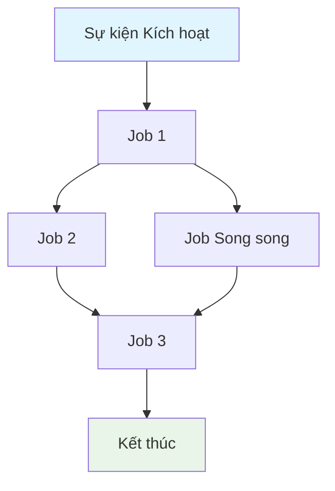

# Tạo Đặc tả Quy trình GitHub Actions

Tạo một đặc tả toàn diện cho quy trình GitHub Actions: `${input:WorkflowFile}`.

Đặc tả này đóng vai trò là một bản mô tả chi tiết về hành vi, yêu cầu và các ràng buộc của quy trình. Nó phải độc lập với việc triển khai, tập trung vào **cái gì** quy trình thực hiện thay vì **làm thế nào** nó được triển khai.

## Yêu cầu Tối ưu hóa cho AI

- **Hiệu quả Token**: Sử dụng ngôn ngữ ngắn gọn nhưng không làm mất đi sự rõ ràng.
- **Dữ liệu có cấu trúc**: Tận dụng bảng, danh sách và sơ đồ để trình bày thông tin dày đặc.
- **Rõ ràng về Ngữ nghĩa**: Sử dụng thuật ngữ chính xác và nhất quán trong toàn bộ tài liệu.
- **Trừu tượng hóa việc Triển khai**: Tránh cú pháp, lệnh hoặc phiên bản công cụ cụ thể.
- **Khả năng Bảo trì**: Thiết kế để dễ dàng cập nhật khi quy trình phát triển.

## Mẫu Đặc tả

Lưu với tên: `/spec/spec-process-cicd-[ten-quy-trinh].md`

````md
---
title: Đặc tả Quy trình CI/CD - [Tên Quy trình]
version: 1.0
date_created: [YYYY-MM-DD]
last_updated: [YYYY-MM-DD]
owner: Đội DevOps
tags: [quy-trinh, cicd, github-actions, tu-dong-hoa, [the-dac-thu-mien]]
---

## Tổng quan Quy trình

**Mục đích**: [Một câu mô tả mục tiêu chính của quy trình]
**Sự kiện Kích hoạt**: [Liệt kê các điều kiện kích hoạt]
**Môi trường Mục tiêu**: [Phạm vi môi trường]

## Sơ đồ Luồng Thực thi


````

## Các Job & Phụ thuộc

| Tên Job | Mục đích   | Phụ thuộc              | Bối cảnh Thực thi   |
| ------- | ---------- | ---------------------- | ------------------- |
| job-1   | [Mục đích] | [Điều kiện tiên quyết] | [Runner/Môi trường] |
| job-2   | [Mục đích] | job-1                  | [Runner/Môi trường] |

## Ma trận Yêu cầu

### Yêu cầu Chức năng

| ID      | Yêu cầu   | Mức độ Ưu tiên | Tiêu chí Chấp nhận         |
| ------- | --------- | -------------- | -------------------------- |
| REQ-001 | [Yêu cầu] | Cao            | [Tiêu chí có thể kiểm thử] |
| REQ-002 | [Yêu cầu] | Trung bình     | [Tiêu chí có thể kiểm thử] |

### Yêu cầu Bảo mật

| ID      | Yêu cầu           | Ràng buộc Triển khai |
| ------- | ----------------- | -------------------- |
| SEC-001 | [Yêu cầu bảo mật] | [Mô tả ràng buộc]    |

### Yêu cầu Hiệu năng

| ID       | Chỉ số   | Mục tiêu           | Phương pháp Đo lường |
| -------- | -------- | ------------------ | -------------------- |
| PERF-001 | [Chỉ số] | [Giá trị mục tiêu] | [Cách đo lường]      |

## Hợp đồng Đầu vào/Đầu ra

### Đầu vào

```yaml
# Biến môi trường
ENV_VAR_1: string # Mục đích: [mô tả]
ENV_VAR_2: secret # Mục đích: [mô tả]

# Kích hoạt từ Repository
paths: [danh sách bộ lọc đường dẫn]
branches: [danh sách mẫu nhánh]
```

### Đầu ra

```yaml
# Đầu ra của Job
job_1_output: string # Mô tả: [mục đích]
build_artifact: file # Mô tả: [loại nội dung]
```

### Secrets & Biến

| Loại     | Tên      | Mục đích   | Phạm vi    |
| -------- | -------- | ---------- | ---------- |
| Secret   | SECRET_1 | [Mục đích] | Quy trình  |
| Variable | VAR_1    | [Mục đích] | Repository |

## Các ràng buộc Thực thi

### Ràng buộc Thời gian chạy

- **Thời gian chờ (Timeout)**: [Thời gian thực thi tối đa]
- **Đồng thời (Concurrency)**: [Giới hạn thực thi song song]
- **Giới hạn Tài nguyên**: [Ràng buộc bộ nhớ/CPU]

### Ràng buộc Môi trường

- **Yêu cầu Runner**: [Nhu cầu về HĐH/phần cứng]
- **Truy cập Mạng**: [Nhu cầu kết nối bên ngoài]
- **Quyền hạn (Permissions)**: [Các cấp truy cập cần thiết]

## Chiến lược Xử lý Lỗi

| Loại Lỗi       | Phản hồi   | Hành động Khôi phục  |
| -------------- | ---------- | -------------------- |
| Lỗi Build      | [Phản hồi] | [Các bước khôi phục] |
| Lỗi Test       | [Phản hồi] | [Các bước khôi phục] |
| Lỗi Deployment | [Phản hồi] | [Các bước khôi phục] |

## Các cổng Chất lượng (Quality Gates)

### Định nghĩa Cổng

| Cổng                | Tiêu chí          | Điều kiện Bỏ qua    |
| ------------------- | ----------------- | ------------------- |
| Chất lượng Mã nguồn | [Các tiêu chuẩn]  | [Khi nào được phép] |
| Quét Bảo mật        | [Các ngưỡng]      | [Khi nào được phép] |
| Độ bao phủ Test     | [Tỷ lệ phần trăm] | [Khi nào được phép] |

## Giám sát & Quan sát (Monitoring & Observability)

### Các chỉ số chính

- **Tỷ lệ Thành công**: [Tỷ lệ phần trăm mục tiêu]
- **Thời gian Thực thi**: [Thời gian mục tiêu]
- **Sử dụng Tài nguyên**: [Phương pháp giám sát]

### Cảnh báo

| Điều kiện   | Mức độ   | Đích thông báo |
| ----------- | -------- | -------------- |
| [Điều kiện] | [Mức độ] | [Ai/Ở đâu]     |

## Các điểm Tích hợp

### Hệ thống Bên ngoài

| Hệ thống   | Loại Tích hợp | Trao đổi Dữ liệu    | Yêu cầu SLA |
| ---------- | ------------- | ------------------- | ----------- |
| [Hệ thống] | [Loại]        | [Định dạng dữ liệu] | [Yêu cầu]   |

### Các quy trình Phụ thuộc

| Quy trình   | Mối quan hệ | Cơ chế Kích hoạt      |
| ----------- | ----------- | --------------------- |
| [Quy trình] | [Loại]      | [Cách được kích hoạt] |

## Tuân thủ & Quản trị (Compliance & Governance)

### Yêu cầu Kiểm toán

- **Nhật ký Thực thi (Logs)**: [Chính sách lưu trữ]
- **Cổng Phê duyệt**: [Các phê duyệt bắt buộc]
- **Kiểm soát Thay đổi**: [Quy trình cập nhật]

### Kiểm soát Bảo mật

- **Kiểm soát Truy cập**: [Mô hình quyền hạn]
- **Quản lý Secret**: [Chính sách luân chuyển]
- **Quét Lỗ hổng**: [Tần suất quét]

## Các trường hợp Biên & Ngoại lệ (Edge Cases & Exceptions)

### Ma trận Kịch bản

| Kịch bản          | Hành vi Mong đợi | Phương pháp Xác thực |
| ----------------- | ---------------- | -------------------- |
| [Trường hợp biên] | [Hành vi]        | [Cách xác minh]      |

## Tiêu chí Xác thực

### Xác thực Quy trình

- **VLD-001**: [Quy tắc xác thực]
- **VLD-002**: [Quy tắc xác thực]

### Điểm chuẩn Hiệu năng (Performance Benchmarks)

- **PERF-001**: [Tiêu chí điểm chuẩn]
- **PERF-002**: [Tiêu chí điểm chuẩn]

## Quản lý Thay đổi

### Quy trình Cập nhật

1.  **Cập nhật Đặc tả**: Sửa đổi tài liệu này trước tiên
2.  **Xem xét & Phê duyệt**: [Quy trình phê duyệt]
3.  **Triển khai**: Áp dụng thay đổi vào quy trình
4.  **Kiểm thử (Testing)**: [Phương pháp xác thực]
5.  **Phát hành (Deployment)**: [Quy trình phát hành]

### Lịch sử Phiên bản

| Phiên bản | Ngày   | Thay đổi       | Tác giả   |
| --------- | ------ | -------------- | --------- |
| 1.0       | [Ngày] | Đặc tả ban đầu | [Tác giả] |

## Các đặc tả Liên quan

- [Liên kết đến các đặc tả quy trình liên quan]
- [Liên kết đến các đặc tả cơ sở hạ tầng]
- [Liên kết đến các đặc tả triển khai]

````

## Hướng dẫn Phân tích

Khi phân tích tệp quy trình:

1.  **Trích xuất Mục đích Cốt lõi**: Xác định mục tiêu kinh doanh chính.
2.  **Sơ đồ hóa Luồng Job**: Tạo biểu đồ phụ thuộc thể hiện thứ tự thực thi.
3.  **Xác định Hợp đồng**: Ghi lại các đầu vào, đầu ra và giao diện.
4.  **Ghi lại các Ràng buộc**: Trích xuất thời gian chờ, quyền hạn và giới hạn.
5.  **Định nghĩa các Cổng Chất lượng**: Xác định các điểm xác thực và phê duyệt.
6.  **Ghi lại các Lối đi Lỗi**: Sơ đồ hóa các kịch bản lỗi và cách khắc phục.
7.  **Trừu tượng hóa việc Triển khai**: Tập trung vào hành vi, không phải cú pháp.

## Hướng dẫn về Sơ đồ Mermaid

### Các loại Luồng
- **Tuần tự**: `A --> B --> C`
- **Song song**: `A --> B & A --> C; B --> D & C --> D`
- **Điều kiện**: `A --> B{Quyết định}; B -->|Có| C; B -->|Không| D`

### Định dạng Kiểu
```mermaid
style TriggerNode fill:#e1f5fe
style SuccessNode fill:#e8f5e8
style FailureNode fill:#ffebee
style ProcessNode fill:#f3e5f5
````

### Các quy trình Phức tạp

Đối với các quy trình có từ 5 job trở lên, hãy sử dụng các đồ thị con (subgraphs):

```mermaid
graph TD
    subgraph "Giai đoạn Build"
        A[Lint] --> B[Test] --> C[Build]
    end
    subgraph "Giai đoạn Deploy"
        D[Staging] --> E[Production]
    end
    C --> D
```

## Chiến lược Tối ưu hóa Token

1.  **Sử dụng Bảng**: Thông tin dày đặc ở định dạng có cấu trúc.
2.  **Viết tắt Nhất quán**: Định nghĩa một lần, sử dụng trong toàn bộ tài liệu.
3.  **Gạch đầu dòng**: Tránh các đoạn văn xuôi.
4.  **Khối mã (Code Blocks)**: Dữ liệu có cấu trúc thay vì tường thuật.
5.  **Tham chiếu chéo**: Liên kết thay vì lặp lại thông tin.

Tập trung vào việc tạo ra một đặc tả vừa là tài liệu vừa là mẫu để cập nhật quy trình.
