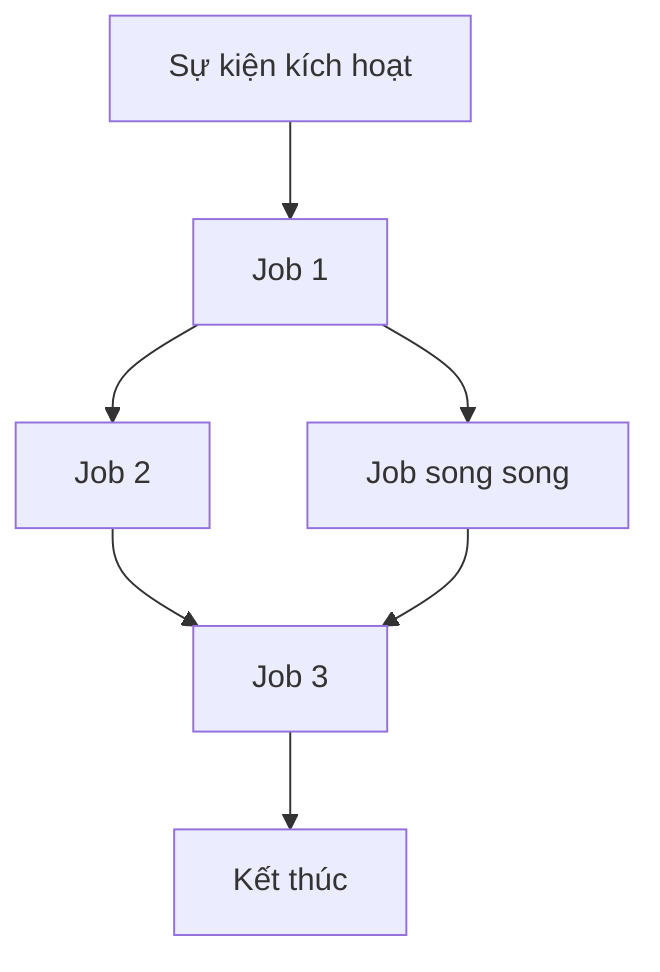

# Tạo Bản Đặc Tả Quy Trình GitHub Actions

Tạo bản đặc tả chi tiết cho workflow GitHub Actions: `${input:WorkflowFile}`.

Bản đặc tả này mô tả mục tiêu, yêu cầu và ràng buộc của workflow. Nó phải độc lập với cách triển khai, tập trung vào **cái gì** workflow thực hiện, không phải **cách** thực hiện.

## Yêu Cầu Tối Ưu Cho AI

- **Tiết kiệm token**: Ngắn gọn nhưng rõ ràng
- **Dữ liệu có cấu trúc**: Dùng bảng, danh sách, sơ đồ
- **Ngữ nghĩa rõ ràng**: Thuật ngữ nhất quán
- **Trừu tượng hóa cách triển khai**: Không chứa cú pháp, lệnh, hoặc phiên bản công cụ cụ thể
- **Dễ bảo trì**: Dễ cập nhật khi workflow thay đổi

## Mẫu Đặc Tả

Lưu tại: `/spec/spec-process-cicd-[workflow-name].md`

```md
---
title: Đặc Tả Quy Trình CI/CD - [Tên Workflow]
version: 1.0
date_created: [YYYY-MM-DD]
last_updated: [YYYY-MM-DD]
owner: Nhóm DevOps
tags: [process, cicd, github-actions, automation, [thẻ chuyên biệt]]
---

## Tổng Quan Workflow

**Mục đích**: [Mục tiêu chính]
**Sự kiện kích hoạt**: [Danh sách điều kiện kích hoạt]
**Môi trường mục tiêu**: [Phạm vi môi trường]

## Sơ Đồ Luồng Thực Thi



(Phần tiếp theo giữ nguyên cấu trúc: Mô tả Job & phụ thuộc, Ma trận yêu cầu, Hợp đồng đầu vào/đầu ra, Ràng buộc thực thi, Chiến lược xử lý lỗi, Cổng chất lượng, Giám sát, Tích hợp, Tuân thủ, Tình huống đặc biệt, Tiêu chí xác nhận, Quản lý thay đổi, và các đặc tả liên quan.)
```

## Hướng Dẫn Phân Tích

Khi phân tích file workflow:

1. **Xác định mục tiêu chính**
2. **Vẽ sơ đồ phụ thuộc job**
3. **Ghi nhận hợp đồng đầu vào/đầu ra**
4. **Nêu rõ ràng các ràng buộc**
5. **Xác định cổng chất lượng**
6. **Mô tả luồng lỗi và phục hồi**
7. **Trừu tượng hóa chi tiết triển khai**

## Hướng Dẫn Sơ Đồ Mermaid

### Loại luồng
- **Tuần tự**: `A --> B --> C`
- **Song song**: `A --> B & A --> C; B --> D & C --> D`
- **Điều kiện**: `A --> B{Quyết định}; B -->|Có| C; B -->|Không| D`

### Tối ưu token
1. **Dùng bảng**
2. **Viết tắt nhất quán**
3. **Gạch đầu dòng**
4. **Block code**
5. **Tham chiếu chéo**
```