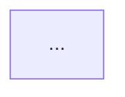

# Tạo Tài Liệu Chuẩn Cho Thành Phần Hướng Đối Tượng (OO Component)

Tạo tài liệu chi tiết cho thành phần hướng đối tượng tại: `${input:ComponentPath}`.

Phân tích thành phần bằng cách đọc mã nguồn trong đường dẫn cung cấp. Nếu là thư mục, phân tích tất cả file nguồn; nếu là file đơn, coi là thành phần chính và phân tích các file liên quan trong cùng thư mục.

## Tiêu Chuẩn Tài Liệu

- DOC-001: Theo mô hình C4 (Context, Containers, Components, Code)
- DOC-002: Tuân theo mẫu tài liệu Arc42
- DOC-003: Tuân thủ chuẩn IEEE 1016
- DOC-004: Áp dụng nguyên tắc Agile Documentation (đủ và có giá trị)
- DOC-005: Hướng tới đối tượng người đọc là developer và maintainer

## Hướng Dẫn Phân Tích

- ANA-001: Xác định loại đường dẫn (thư mục hoặc file đơn)
- ANA-002: Xem cấu trúc class và kế thừa
- ANA-003: Nhận diện pattern thiết kế
- ANA-004: Ghi lại public API, interface, dependency
- ANA-005: Xác định pattern thuộc nhóm tạo lập / cấu trúc / hành vi
- ANA-006: Ghi chú tham số hàm, giá trị trả về, exception
- ANA-007: Đánh giá hiệu năng, bảo mật, độ tin cậy, khả năng bảo trì
- ANA-008: Suy ra mô hình tích hợp và luồng dữ liệu

## Tối Ưu Theo Ngôn Ngữ

- LNG-001: **C#/.NET** - async/await, DI, config, dispose
- LNG-002: **Java** - Spring, annotation, exception, packaging
- LNG-003: **TypeScript/JS** - module, async, type, npm
- LNG-004: **Python** - package, venv, type hint, test

## Xử Lý Lỗi

- ERR-001: Đường dẫn không tồn tại
- ERR-002: Không tìm thấy file nguồn
- ERR-003: Cấu trúc không rõ ràng
- ERR-004: Pattern không chuẩn
- ERR-005: Thiếu mã nguồn

## Định Dạng Đầu Ra

Markdown rõ ràng, phân cấp heading hợp lý, code block, bảng, bullet.

## Vị Trí Lưu File

Lưu tại `/docs/components/` với tên `[component-name]-documentation.md`.

## Cấu Trúc Tài Liệu Bắt Buộc

```md
---
title: [Tên thành phần] - Tài Liệu Kỹ Thuật
component_path: `${input:ComponentPath}`
version: [Tùy chọn]
date_created: [YYYY-MM-DD]
last_updated: [Tùy chọn]
owner: [Tùy chọn]
tags: [Tùy chọn]
---

# [Tên thành phần] Documentation

[Mô tả ngắn gọn]

## 1. Tổng Quan Thành Phần

### Mục đích / Trách nhiệm
- OVR-001: ...
- OVR-002: ...
- OVR-003: ...

## 2. Kiến Trúc

- ARC-001: Pattern sử dụng
- ARC-002: Dependency nội bộ / bên ngoài
- ARC-003: Quan hệ và tương tác
- ARC-004: Sơ đồ UML
- ARC-005: Mermaid diagram


(classDiagram minh họa)

## 3. Tài Liệu Interface

| Method/Property | Purpose | Parameters | Return Type | Usage Notes |
|-----------------|---------|------------|-------------|-------------|

## 4. Chi Tiết Triển Khai

- IMP-001: Class chính
- IMP-002: Cấu hình
- IMP-003: Thuật toán
- IMP-004: Hiệu năng

## 5. Ví Dụ Sử Dụng

### Cơ bản
```csharp
...
```

### Nâng cao
```csharp
...
```

## 6. Thuộc Tính Chất Lượng

- QUA-001: Bảo mật
- QUA-002: Hiệu năng
- QUA-003: Độ tin cậy
- QUA-004: Bảo trì
- QUA-005: Mở rộng

## 7. Tham Khảo

- REF-001: Dependency
- REF-002: Cấu hình
- REF-003: Test
- REF-004: Troubleshoot
- REF-005: Link liên quan
```